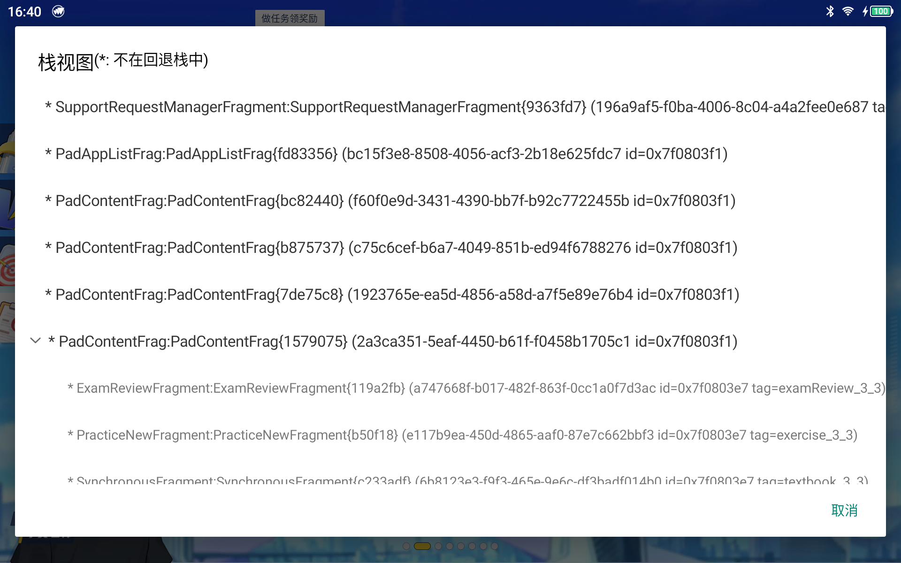

# 打印Fragment栈

## 依赖方式

```groovy
 implementation "com.muzi:fragment-stack:1.0.0"
```

## 使用

```kotlin
 private val fragmentStack by lazy { DebugStackDelegate(Activity) }
```

### 1. 显示悬浮球

```kotlin
fragmentStack.onPostCreate()
```

### 2. 以Dialog形式显示数据

```kotlin
fragmentStack.showFragmentStackHierarchyView()
```

效果如下


### 3. 以Log形式打印栈信息

```kotlin
fragmentStack.logFragmentRecords(TAG)
```